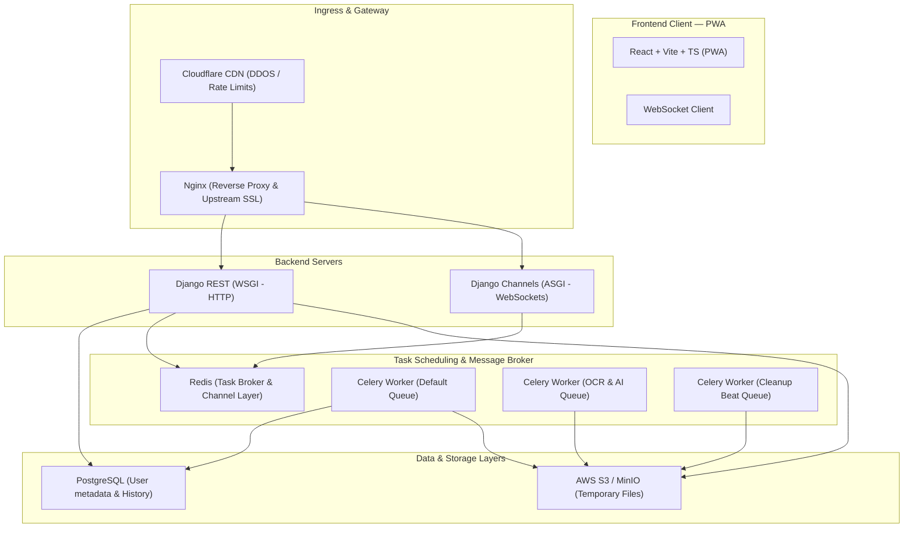
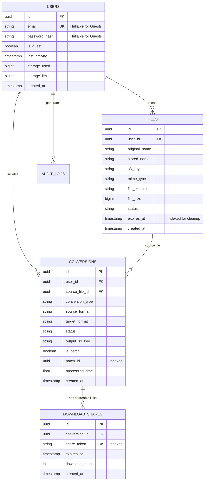
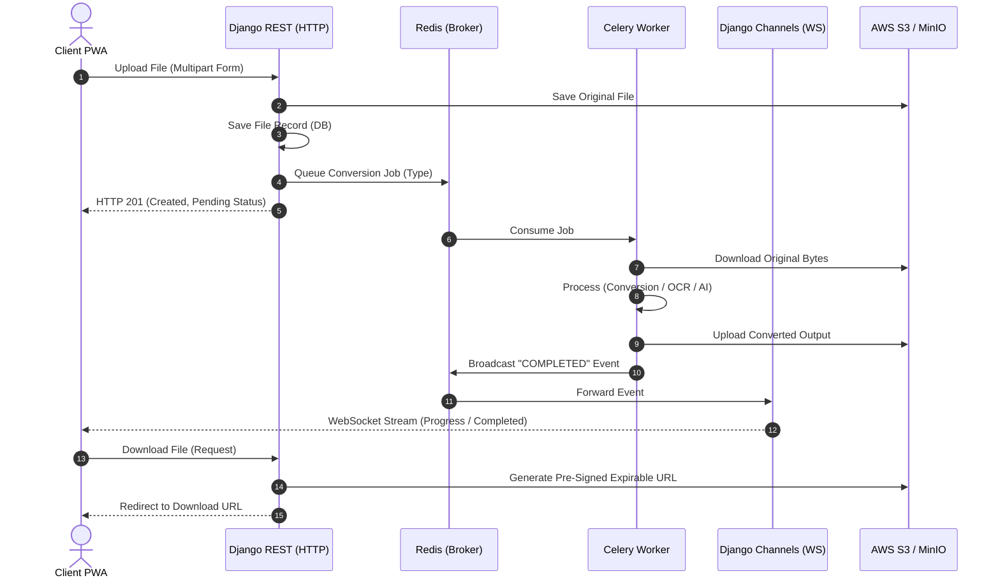
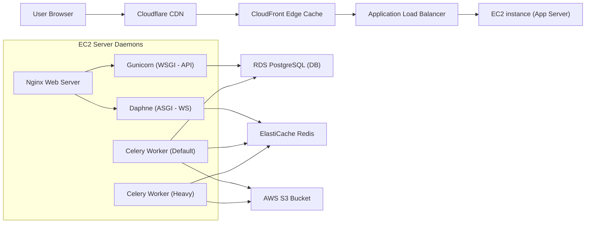

# Cloud File Converter (Production-Grade SaaS)

<div align="center">


**A 100% Free, High-Performance, Cloud-Native File Conversion & Processing Platform.**

Convert documents, images, and archives, extract text with OCR, and summarize files with AI — instantly in the cloud.

</div>

---

## 🏗️ Architecture Diagrams

### A. System Architecture
Comprehensive view of system boundary connections, showing secure ingress, ASGI/WSGI backend separation, task priority queues, and backing storage.



---

### B. Database ER Diagram
Shows relation mappings, Compound Indexes (optimized for prunes), and guest-specific schema customizations (email and password nullability).



---

### C. Conversion Workflow Diagram
Demonstrates how uploads map to async processing jobs, WebSocket streams, and secure file delivery.



---

### D. Deployment Architecture
High-availability infrastructure configurations for AWS environments.



---

## ✨ Feature Showcase

### 1. Seamless Guest Mode
- **Zero Registration**: Drag-and-drop files to convert immediately.
- **Auto-Provisioning**: Creates a temporary guest profile and provides JWT tokens seamlessly in the background.

### 2. High-Performance Batch Processing
- **Checklist Workflow**: Upload up to 10 files simultaneously and pick custom target formats per file.
- **Batch Zipping**: Compress all successfully completed files into a single ZIP archive for one-click downloads.

### 3. OCR & AI Summarization
- **Scanned Text Extraction**: Translates scanned PDFs and images into structured text using Tesseract.
- **AI Document Summarizer**: Leverages Google Gemini API (with a local extractive text ranker fallback) to summarize long documents.

### 4. Real-Time WS Updates & Previews
- **WebSocket Broadcasts**: Shows real-time progress bars as tasks execute.
- **File Previews**: Live visual previews of images and text snippets before converting.

---

## 📡 API Reference Overview

### Health Checks
- `GET /api/v1/health/` — Validates DB, Redis Cache, and S3 Storage connection status (responds with 200 OK or 503 Service Unavailable).

### Authentication
- `POST /api/v1/auth/guest/` — Provision a temporary guest account.
- `POST /api/v1/auth/register/` / `login/` — Standard email registration and login (returns simple JWTs).

### Conversions & Sharing
- `POST /api/v1/conversions/batch/` — Start concurrent conversions.
- `POST /api/v1/conversions/<uuid:id>/share/` — Generate 24-hour cryptographic share links.
- `GET /api/v1/conversions/share/<str:token>/` — Public, unauthenticated file detail/download.

---

## 📊 Performance Metrics

We executed concurrent conversion load tests (Image -> JPG, Text -> PDF, ZIP Creation) using our benchmark suite:

| Load Size | Active Workers | Duration (s) | Success Rate | Throughput (files/s) | Avg Latency (ms) | P95 Latency (ms) |
|:---|:---|:---|:---|:---|:---|:---|
| **100 Files** | 8 | 0.13s | 100% | 742.83 | 8.39ms | 70.30ms |
| **500 Files** | 8 | 0.31s | 100% | 1624.36 | 2.94ms | 6.31ms |
| **1000 Files** | 8 | 0.61s | 100% | 1633.43 | 3.00ms | 6.44ms |

*To run benchmarks locally, execute: `python benchmark.py`*

---

## 🔒 Security Hardening & Observability

- **Sentry Error Tracking**: Full event capturing and profiling in production settings.
- **Structured Logging**: Log entries formatted as JSON structures using `python-json-logger`.
- **IP Rate Throttles**: Strict daily quota throttles (10 conversions/day for guests, 100 for registered users).
- **MIME Magic Verification**: Prevents extension spoofing by validating files using `python-magic`.

---

## 🚀 Quick Start (Local Docker Dev)

1. Clone repo & create env file:
   ```bash
   git clone <repo-url>
   cd cloud-file-converter
   cp .env.example .env
   ```
2. Launch Docker container stack:
   ```bash
   docker compose up -d
   ```
   *Access: Frontend at http://localhost:5173, API Docs at http://localhost:8000/api/docs/*

---

## 📂 Further Reading & Portfolio Resources

- **[Portfolio Case Study](file:///docs/portfolio_case_study.md)** — Architectural decisions, engineering challenges, and structural trade-offs.
- **[AWS Production Deployment Guide](file:///docs/deployment_guide.md)** — Complete Nginx reverse proxy configs, Supervisor daemon scripts, and CloudFront caching policies.
